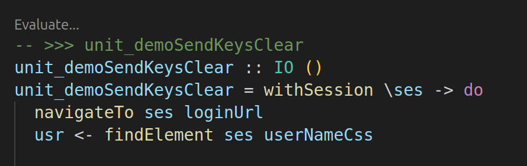

# webdriver-examples

- [webdriver-examples](#webdriver-examples)
  - [About These Examples](#about-these-examples)
  - [Core Modules](#core-modules)
    - [IORunner](#iorunner)
    - [IOAPI](#ioapi)
    - [WebDriverE2EDemoTest](#webdrivere2edemotest)
  - [Running Examples (VSCode Dev-Container)](#running-examples-vscode-dev-container)
  - [Running Examples (Manual Configuration)](#running-examples-manual-configuration)
    - [Prerequisites](#prerequisites)
      - [1. Tasty Discover Installed](#1-tasty-discover-installed)
      - [2. Web Driver Installed](#2-web-driver-installed)
      - [3. Web Driver Running](#3-web-driver-running)
    - [4. Update 'Config'](#4-update-config)
  - [Executing the Examples](#executing-the-examples)
    - [Evaluate...](#evaluate)
    - [cabal repl](#cabal-repl)
    - [cabal test](#cabal-test)
    - [Fixing Geckodriver Firefox Profile Issues](#fixing-geckodriver-firefox-profile-issues)

## About These Examples

These examples demonstrate a minimal wrapper implementation around the [`webdriver-precore`](https://hackage.haskell.org/package/webdriver-precore) library for basic browser automation. 

Key simplifications compared to a production-ready framework:
- No utility functions or automated browser/session management
- Hardcoded configuration options
- Direct console logging (no structured logging)
- Included sleeps and debug outputs for observability
- Minimal robustness features (no advanced waits or retry mechanisms)

The examples cover all [W3C WebDriver endpoints](https://www.w3.org/TR/webdriver2/#endpoints) using [the-internet](https://the-internet.herokuapp.com) test site.

## Core Modules

### IORunner

[IORunner](./driver-demo-e2e/IORunner.hs) exports a single `run` function that accepts a [webdriver-precore W3Spec](https://hackage-content.haskell.org/package/webdriver-precore-0.0.0.1/package/docs/WebDriverPreCore.html#g:14) and performs HTTP requests to an active WebDriver instance.

### IOAPI

[IOAPI](./driver-demo-e2e/IOAPI.hs) is [W3C WebDriver](https://www.w3.org/TR/webdriver2) client implemented by applying `run` to every endpoint exported by [webdriver-precore]((https://hackage-content.haskell.org/package/webdriver-precore).

### WebDriverE2EDemoTest

[WebDriverE2EDemoTest](./driver-demo-e2e/WebDriverE2EDemoTest.hs) is \"unit test" module where the unit tests are actually example stubs that demonstrate driving a browser via the [IOAPI](./driver-demo-e2e/IOAPI.hs).

## Running Examples (VSCode Dev-Container)

 *The following assumes the pre-requisites for [dev-containers](https://code.visualstudio.com/docs/devcontainers/containers#_getting-started) are installed* 
 
 *See [Running Examples (Manual Configuration)](#running-examples-manual-configuration) if you are not dev-container user.*

The dev-container provided includes all the Haskell tools required, pre-compiled dependencies and Firefox and geckodriver. The examples will be compiled and geckodriver started when the container starts.
 
From VSCode invoke: <BR/> 
&nbsp;&nbsp; \>> `Show All Commands` <BR/> 
&nbsp;&nbsp; \>> `Dev Containers: Clone Repository in Dev Container Volume...`<BR/>
&nbsp;&nbsp; \>> `Clone a repository from Github in a Container Volume`<BR/>
&nbsp;&nbsp; \>> search and select `pyrethrum/webdriver`<BR/>
&nbsp;&nbsp; \>> `main` branch

Once the container downloads starts, you should be ready to run the examples (see [Executing the Examples](#executing-the-examples) below).

## Running Examples (Manual Configuration)

### Prerequisites
*Assuming Haskell and the related tooling is installed.*

#### 1. Tasty Discover Installed

The test suite that enables these examples to be run is generated by [tasty-discover](https://hackage.haskell.org/package/tasty-discover). 

In order to build the test suite `tasty-discover` will need to be installed:

```bash
> cabal install tasty-discover
```

#### 2. Web Driver Installed

A browser and corresponding vendor provided WebDriver is required. These stubs have been run with Firefox and Chrome, drivers although other drivers are available, and should work.

Drivers can be downloaded from the vendors' web sites e.g.:
  1. [Firefox](https://github.com/mozilla/geckodriver/releases)
  2. [Chrome](https://googlechromelabs.github.io/chrome-for-testing/)

*Follow the vendor / community provided documentation for installation instructions*

**Note:** Linux users of `geckodriver` (the Firefox driver), may, under some circumstances, encounter **profile related errors when initialising WebDriver** sessions. A solution can be found [at the end of this document](#fixing-geckodriver-firefox-profile-issues)

#### 3. Web Driver Running

Before running any of the examples you need to invoke the WebDriver from the terminal. On Linux this can be done with one of the following bash commands:

**Firefox (Geckodriver)**

*`--log trace` is optional*

```
>  pkill -f geckodriver || true  && geckodriver --log trace
```

*expect output like*

```
1744430539316   geckodriver     INFO    Listening on 127.0.0.1:4444
1744430539316   webdriver::server       TRACE   Build standard route for /status
.... and many other trace statements if running with --log trace
```

**Chrome (Chromedriver)**

*`--log-level=ALL` is optional*

*The port is set to 4444 to match the port hard coded in our test suite*

```
> pkill -f chromedriver || true && chromedriver --log-level=ALL --port=4444
```

*expect output like*

```
Starting ChromeDriver 135.0.7049.52 (9ba7e609d28c509a8ce9265c2247065d8d251173-refs/branch-heads/7049_41@{#4}) on port 4444
Only local connections are allowed.
Please see https://chromedriver.chromium.org/security-considerations for suggestions on keeping ChromeDriver safe.
ChromeDriver was started successfully on port 4444.
```

### 4. Update 'Config'

"Configuration" for these examples has been achieved through the time honoured technique of [hard coding values in the source file (WebDriverE2EDemoTest.hs)](./driver-demo-e2e/WebDriverE2EDemoTest.hs)

```haskell
-- #################### Config ######################

-- set to False for Chrome
useFirefox :: Bool
useFirefox = True

-- see readme
customFirefoxProfilePath :: Maybe Text
customFirefoxProfilePath = Nothing
  -- customFirefoxProfilePath = Just "./webdriver-examples/driver-demo-e2e/.profile/WebDriverProfile"

```

*`useFirefox` is self explanatory*

*`customFirefoxProfilePath` should be `Nothing` unless fixing issues related to [Firefox profiles in geckodriver](#fixing-geckodriver-firefox-profile-issues). See the linked topic for further details.*

## Executing the Examples

Once the [driver is running](#3-web-driver-running), the recommended way to experiment in these examples is to use the `Evaluate...` lens provided by Haskell Language Server in VSCode.

### Evaluate...

1. From VSCode `Ctrl+P` \>> search `demo`
2. Open `WebDriverE2EDemoTest`
3. Wait for HLS to process the file, at which point the `Evaluate...` lens will be visible



Clicking `Evaluate...` will execute the test.
* any exceptions will be inserted in the source file under the evaluation
* any console logs generated form the test will be piped to the `OUTPUT` window for `Haskell (webdriver)` 
### cabal repl
*Alternatively tests can be run in `cabal repl --enable-tests` from the `webdriver-examples` directory:*

```
~/webdriver/webdriver-examples$ cabal repl --enable-tests
ghci> WebDriverE2EDemoTest.unit_demoSendKeysClear
fill in user name
clear user name
```

### cabal test

*Or run all tests by running `cabal test` from the `webdriver-examples` directory:*

```
~/webdriver/webdriver-examples$ cabal test
.. all test logs 
```

### Fixing Geckodriver Firefox Profile Issues

There is a [known issue](https://github.com/mozilla/geckodriver/releases/tag/v0.36.0) with geckodriver on linux machines when Firefox has been installed inside a container such as when installed with `snap` or `flatpak` and also the `default Firefox installation` for Ubuntu.

When `Firefox` is installed in this way, `geckodriver` does not have the required permissions to access the Firefox profile directory causing an exception to be thrown on session creation:


One solution is to create a profile in a directory somewhere accessible to geckodriver on the file system:

1. Create a new subdirectory in `.profiles` name `WebDriverProfile`, so you will end up with: `/webdriver/webdriver-examples/driver-demo-e2e/.profile/WebDriverProfile`
2. In Firefox type the following into the search bar: `about:profiles`
3. `Create New Profile` 
4. `Profile Name:` WebDriver
5. `Next` >> `Choose Folder` >> `/webdriver/webdriver-examples/driver-demo-e2e/.profile/WebDriverProfile`
6. `Finish`
7. Change the *Config* in the [WebDriverE2EDemoTest](./driver-demo-e2e/WebDriverE2EDemoTest.hs) to point to the directory of your new profile:

```haskell

-- #################### Config ######################

-- set to False for Chrome
useFirefox :: Bool
useFirefox = True

-- see readme
customFirefoxProfilePath :: Maybe Text
customFirefoxProfilePath = Just "[YOUR REPOS DIRECTORY]/webdriver-examples/driver-demo-e2e/.profile/WebDriverProfile"

```

Tests should now be able to create sessions successfully.

*Note: the suggested `.profile` directory is included in `.gitignore` so as not pollute your git repo.*

