# webdriver-tests

- [webdriver-tests](#webdriver-tests)
  - [About This Test Suite](#about-this-test-suite)
  - [Core Modules](#core-modules)
  - [Running Examples (VSCode Dev-Container)](#running-examples-vscode-dev-container)
    - [Preparing for Headed Demos](#preparing-for-headed-demos)
    - [Initialising the Dev-Container](#initialising-the-dev-container)
  - [Running Examples (Manual Configuration)](#running-examples-manual-configuration)
    - [Prerequisites](#prerequisites)
      - [1. LFS Installed (Optional)](#1-lfs-installed-optional)
      - [2. Web Driver Installed](#2-web-driver-installed)
      - [3. The Project Builds](#3-the-project-builds)
      - [4. Web Driver Running](#4-web-driver-running)
      - [4. Configuration Set](#4-configuration-set)
  - [Executing Demos from the Test Suite](#executing-demos-from-the-test-suite)
    - [Evaluate...](#evaluate)
    - [Dev-Container Configuration Notes](#dev-container-configuration-notes)
    - [cabal repl](#cabal-repl)
    - [cabal test](#cabal-test)
  - [Fixing Geckodriver Firefox Profile Issues on Linux](#fixing-geckodriver-firefox-profile-issues-on-linux)

## About This Test Suite

While `webdriver-precore` provides types without a runner implementation, a runner is needed to verify these types against a driver. This test suite therefore serves two purposes:

1. provides a demo client implementation (not part of `webdriver-precore`) for both HTTP and BiDi protocols
2. the demos are used to test the types exported by `WebDriverPreCore.HTTP.API` and `WebDriverPreCore.BiDi.API` by running the demo client implementation against a driver.

These demos implement a minimal wrapper around the [`webdriver-precore`](https://hackage.haskell.org/package/webdriver-precore) library for basic browser automation.

Key simplifications compared to a production-ready framework:
- No utility functions or automated browser/session management
- Minimal robustness features 
  - no advanced waits or retry mechanisms
  - no timeout on BiDi socket commands
  - calling `session.end` on the BiDi runner can throw `ConnectionClosed` when the server closes the WebSocket after session termination
- [The handle pattern](https://jaspervdj.be/posts/2018-03-08-handle-pattern.html) is used due to its simplicity. Alternative abstractions could have UX advantages

The demos cover all W3C WebDriver endpoints for [HTTP](https://www.w3.org/TR/webdriver2/#endpoints) protocol and [BiDi](https://www.w3.org/TR/webdriver-bidi/) commands and events.

## Core Modules

The module structure for BiDi looks like this. 



*For HTTP, the structure is the same but for the use of an `HttpClient` module instead of a `Socket`.*

## Running Examples (VSCode Dev-Container)
 
 *See [Running Examples (Manual Configuration)](#running-examples-manual-configuration) if you are not a dev-container user.*

 *The following assumes the pre-requisites for [dev-containers](https://code.visualstudio.com/docs/devcontainers/containers#_getting-started) are installed* 

 ### Preparing for Headed Demos

Headed (visible browser) demos require a display server for the browser to render to. The dev-container needs access to your host's display to show the browser window.

Note: you can still run the demos headless in the container if you skip this step.

**Linux:**

No manual setup required. The dev-container automatically configures X11 access on startup via `initializeCommand` in `devcontainer.json`.

If you encounter X11 issues, ensure `xhost` is installed on your host:
```bash
# Debian/Ubuntu
sudo apt-get install x11-xserver-utils

# Fedora
sudo dnf install xorg-x11-server-utils

# Arch
sudo pacman -S xorg-xhost
```

If the automatic setup fails (e.g., permission errors on the X11 socket), you can manually run on the host:
```bash
xhost +local:
sudo chmod a+rw /tmp/.X11-unix/X*
```

You can verify X11 is working from inside the container by running:
```bash
bash ./dev/test-x11.sh
```

**macOS:**
1. Install [XQuartz](https://www.xquartz.org/)
2. Open XQuartz, go to `Preferences` → `Security` → enable `Allow connections from network clients`
3. Restart XQuartz
4. Run on your host:
   ```bash
   xhost +localhost
   ```

**Windows:**
1. Install an X server such as [VcXsrv](https://sourceforge.net/projects/vcxsrv/) or [X410](https://x410.dev/)
2. Launch the X server with `Disable access control` enabled
3. Ensure your firewall allows connections on the X11 port

### Initialising the Dev-Container

The dev-container provided includes all the Haskell tools required, pre-compiled dependencies and Firefox and geckodriver as well as the `DebugConfig.hs` being initialised. The examples will be compiled and geckodriver started when the container starts.
 
From VSCode invoke: <BR/> 
&nbsp;&nbsp; \>> `Show All Commands` <BR/> 
&nbsp;&nbsp; \>> `Dev Containers: Clone Repository in Dev Container Volume...`<BR/>
&nbsp;&nbsp; \>> `Clone a repository from Github in a Container Volume`<BR/>
&nbsp;&nbsp; \>> search and select `pyrethrum/webdriver`<BR/>
&nbsp;&nbsp; \>> `main` branch

Once the container is initialised, you should be ready to run the examples (see [Executing Demos from the Test Suite](#executing-demos-from-the-test-suite) below).

## Running Examples (Manual Configuration)

### Prerequisites
*Assuming Haskell and the related tooling is installed.*

#### 1. LFS Installed (Optional)

A handful of demos rely on binary files that will not be pulled into your repo without LFS [Git Large File Storage](https://git-lfs.com/) activated on your local. You will need to install LFS for these demos to run successfully.

#### 2. Web Driver Installed

A browser and corresponding vendor provided WebDriver is required. These stubs have been run with Firefox and Chrome, drivers although other drivers are available, and should work.

Drivers can be downloaded from the vendors' web sites e.g.:
  1. [Firefox](https://github.com/mozilla/geckodriver/releases)
  2. [Chrome](https://googlechromelabs.github.io/chrome-for-testing/)

*Follow the vendor / community provided documentation for installation instructions*

**Note:** Linux users of `geckodriver` (the Firefox driver), may, under some circumstances, encounter **profile related errors when initialising WebDriver** sessions. A solution can be found [at the end of this document](#fixing-geckodriver-firefox-profile-issues)

#### 3. The Project Builds

In the integrated terminal in your IDE run:

1. ensure you are in the project directory
2. `cabal update`
3. `cabal build all --enable-tests `

On linux this would look something like

```bash
~/repos/webdriver$ cabal update

Configuration is affected by the following files:
- cabal.project
Downloading the latest package list from hackage.haskell.org
Package list of hackage.haskell.org has been updated.
The index-state is set to 2025-06-22T01:41:09Z.
To revert to previous state run:
    cabal v2-update 'hackage.haskell.org,2025-06-22T00:48:21Z'

~/repos/webdriver$ cabal build all --enable-tests 

Configuration is affected by the following files:
... many build log entries
```

*You may need to restart your IDE or invoke `Haskell: Restart Haskell LSP server` after your first rebuild.*
#### 4. Web Driver Running

Before running any of the examples you need to invoke the WebDriver from the terminal. On Linux this can be done by running the provided script:

**Firefox (Geckodriver)**

```
>  bash ./dev/start-geckodriver.sh
```

*expect output like*

```
geckodriver started with PID 17186 at http://127.0.0.1:4444
```

*See the driver documentation if you are using another OS*

**Chrome (Chromedriver)**


```
>  bash ./dev/start-chromedriver.sh
```

*expect output like*

```
chromedriver started with PID 44681 at http://127.0.0.1:4444
Waiting for chromedriver...
Port 4444 is open
```

#### 4. Configuration Set

Before running any of the `Demo`s you will need to set up a `DemoConfig.hs` file as follows:

1. copy `webdriver-precore/test/DebugConfig.hs.template` => `webdriver-precore/test/DebugConfig.hs`

    `DebugConfig.hs` is included in `.gitIgnore` so won't be added to git. If you are using VSCode you will need to open this for the first time via the Project Explorer as most shortcut keys ignore files ignored by git.

2. copy `cabal.project.local.template` => `cabal.project.local` 

    Similar to the above `cabal.project.local` is ignored by git. The purpose of this file is to set a flag called `debug-local-config` which will cause `DebugConfig.hs` to be included in the build by `webdriver-precore/webdriver-precore.cabal`

The initial `DebugConfig.hs` looks like this:

```Haskell
module DebugConfig (
  debugConfig
) where

import Config
  ( Config (..),
    DemoBrowser (..),
  )

debugConfig :: Config
debugConfig =
  MkConfig
    { browser =
        Firefox
          { headless = False,
            -- profilePath = Just "[YOUR FIREFOX PROFILE PATH HERE]"
            profilePath = None
          },
      logging = True,
      httpUrl = "127.0.0.1",
      httpPort = 4444,
      pauseMS = 2000
    }
```

*This is running a headed (visible) FireFox browser with the default profile path. It is also pausing the execution for 2 seconds every time the demo hits a pause clause and logging details of each interaction to the console and a log file that will be called `eval.log`. This is relatively slow, verbose config that you would typically use when browsing and manually evaluating demos.*

*You will need to change the config according to your requirements.*

Note: This test suite can also be configured via a `config.dhall` file which is used in the dev-container.

## Executing Demos from the Test Suite

Once the [driver is running](#3-web-driver-running), the recommended way to experiment in these examples is to use the `Evaluate...` lens provided by Haskell Language Server in VSCode.

### Evaluate...

1. From VSCode `Ctrl+P` \>> search `demo`
2. Open the desired demo, e.g. `HttpDemo`
3. Wait for HLS to process the file, at which point the `Evaluate...` lens will be visible


Clicking `Evaluate...` will execute the demo.
* any exceptions will be inserted in the source file under the evaluation
* any console logs generated from the test will be piped to the `OUTPUT` window for `Haskell (webdriver)` 
* the output will be piped to `eval.log`


### Dev-Container Configuration Notes

If you are running inside a dev-container then on the first run a configuration file will be created at `.config/config.dhall` within the test directory. This file is ignored by git, so navigate to it via the **Project Explorer** as most keyboard shortcuts will skip ignored files.

By default, demos run **headed** (visible browser window). Output can be viewed in:
- You should see Firefox running when a demo runs
- The VSCode **OUTPUT** window → select `Haskell` from the dropdown
- The `eval.log` file created in the `webdriver` directory

To switch to **headless** mode (no visible browser), edit `.config/config.dhall` and change the `headless` property:

```haskell
let browser : Browser = 
      Browser.Firefox 
        { headless = True  -- change from False to True
        , profilePath = None Text
        }
```

**Important:** Running headed demos requires display server access. See [Preparing for Headed Demos](#preparing-for-headed-demos) for the required host setup.

### cabal repl
*Alternatively tests can be run in `cabal repl webdriver-precore:test:test` from the `webdriver` directory:*

```
~/webdriver$ cabal repl webdriver-precore:test:test
ghci> HTTP.DemoUtils.runDemo Http.demoSendKeysClear
Using debug local config
[LOG] send keys clear
[LOG] Starting Logger thread
...
```

### cabal test

*Or run all tests by running `cabal test all --test-show-details=streaming 2>&1 | tee test-all.log` from the `webdriver` directory:*

```
~/webdriver/$ cabal test all --test-show-details=streaming 2>&1 | tee test-all.log
.. all test logs 
```

## Fixing Geckodriver Firefox Profile Issues on Linux

There is a [known issue](https://github.com/mozilla/geckodriver/releases/tag/v0.36.0) with geckodriver on linux machines when Firefox has been installed inside a container such as when installed with `snap` or `flatpak` and also the `default Firefox installation` for Ubuntu.

When `Firefox` is installed in this way, `geckodriver` does not have the required permissions to access the Firefox profile directory causing an exception to be thrown on session creation:


One solution is to create a profile in a directory somewhere accessible to geckodriver on the file system:

1. Create a new folder called `test-firefox-profile` in an accessible place such as your linux `Home` directory
2. In Firefox type the following into the search bar: `about:profiles` to be taken to `About Profiles`
3. Note your current `Default Profile`
4. `Create New Profile` 
5. `Next`
6. `Profile Name:` **WebDriver**
7.  `Choose Folder...` >> browse to `test-firefox-profile` >> `Select`
8. `Finish`
9. This new profile will automatically be set to the default profile. Set the `Default Profile` back to your initial profile or you will not be able to see the usual shortcuts and other settings when you restart Firefox
10. Copy the `Root Directory` path for the **WebDriver** profile to the clipboard
11. Update the browser `profilePath` in [DebugConfig.hs](#4-configuration-set):

Tests should now be able to create sessions successfully.
