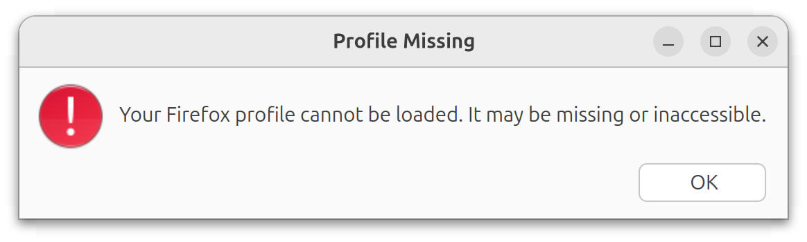

# webdriver-examples

- [webdriver-examples](#webdriver-examples)
  - [About These Examples](#about-these-examples)
  - [Core Modules](#core-modules)
    - [HttpRunner](#httprunner)
    - [HttpAPI](#httpapi)
    - [HttpE2EDemoTest](#httpe2edemotest)
  - [Running Examples (VSCode Dev-Container)](#running-examples-vscode-dev-container)
  - [Running Examples (Manual Configuration)](#running-examples-manual-configuration)
    - [Prerequisites](#prerequisites)
      - [1. Web Driver Installed](#1-web-driver-installed)
      - [2. The Project Builds](#2-the-project-builds)
      - [3. Web Driver Running](#3-web-driver-running)
      - [4. Configuration Set](#4-configuration-set)
  - [Executing Demos from the Test Suite](#executing-demos-from-the-test-suite)
    - [Evaluate...](#evaluate)
    - [cabal repl](#cabal-repl)
    - [cabal test](#cabal-test)
  - [Updating Test Configuration](#updating-test-configuration)
  - [Fixing Geckodriver Firefox Profile Issues on Linux](#fixing-geckodriver-firefox-profile-issues-on-linux)

## About These Examples

These examples demonstrate a minimal wrapper implementation around the [`webdriver-precore`](https://hackage.haskell.org/package/webdriver-precore) library for basic browser automation. 

Key simplifications compared to a production-ready framework:
- No utility functions or automated browser/session management
- Direct console logging (no structured logging)
- Included sleeps and debug outputs for observability
- Minimal robustness features (no advanced waits or retry mechanisms)

The examples cover all [W3C WebDriver endpoints](https://www.w3.org/TR/webdriver2/#endpoints) using [the-internet](https://the-internet.herokuapp.com) test site.

## Core Modules

### HttpRunner

[HttpRunner](./driver-demo-e2e/Http/HttpRunner.hs) exports a single `run` function that accepts a [webdriver-precore HttpSpec](https://hackage-content.haskell.org/package/webdriver-precore-0.0.0.1/package/docs/WebDriverPreCore.html#g:14) and performs HTTP requests to an active WebDriver instance.

### HttpAPI

[HttpAPI](./driver-demo-e2e/Http/HttpAPI.hs) is [W3C WebDriver](https://www.w3.org/TR/webdriver2) client implemented by applying `run` to every endpoint exported by [webdriver-precore](https://hackage-content.haskell.org/package/webdriver-precore).

### HttpE2EDemoTest

[HttpE2EDemoTest](./driver-demo-e2e/Http/HttpE2EDemoTest.hs) is \"unit test" module where the unit tests are actually example stubs that demonstrate driving a browser via the [HttpAPI](./driver-demo-e2e/Http/HttpE2EDemoTest.hs).

## Running Examples (VSCode Dev-Container)

 *The following assumes the pre-requisites for [dev-containers](https://code.visualstudio.com/docs/devcontainers/containers#_getting-started) are installed* 
 
 *See [Running Examples (Manual Configuration)](#running-examples-manual-configuration) if you are not dev-container user.*

The dev-container provided includes all the Haskell tools required, pre-compiled dependencies and Firefox and geckodriver. The examples will be compiled and geckodriver started when the container starts.
 
From VSCode invoke: <BR/> 
&nbsp;&nbsp; \>> `Show All Commands` <BR/> 
&nbsp;&nbsp; \>> `Dev Containers: Clone Repository in Dev Container Volume...`<BR/>
&nbsp;&nbsp; \>> `Clone a repository from Github in a Container Volume`<BR/>
&nbsp;&nbsp; \>> search and select `pyrethrum/webdriver`<BR/>
&nbsp;&nbsp; \>> `main` branch

Once the container downloads starts, you should be ready to run the examples (see [Executing the Examples](#executing-the-examples) below).

## Running Examples (Manual Configuration)

### Prerequisites
*Assuming Haskell and the related tooling is installed.*

#### 1. Web Driver Installed

A browser and corresponding vendor provided WebDriver is required. These stubs have been run with Firefox and Chrome, drivers although other drivers are available, and should work.

Drivers can be downloaded from the vendors' web sites e.g.:
  1. [Firefox](https://github.com/mozilla/geckodriver/releases)
  2. [Chrome](https://googlechromelabs.github.io/chrome-for-testing/)

*Follow the vendor / community provided documentation for installation instructions*

**Note:** Linux users of `geckodriver` (the Firefox driver), may, under some circumstances, encounter **profile related errors when initialising WebDriver** sessions. A solution can be found [at the end of this document](#fixing-geckodriver-firefox-profile-issues)

#### 2. The Project Builds

In the the integrated terminal in your IDE run:

1. ensure you are in the project directory
2. `cabal update`
3. `cabal build all --enable-tests `

On linux  this would look something like

```bash
~/repos/webdriver$ cabal update

Configuration is affected by the following files:
- cabal.project
Downloading the latest package list from hackage.haskell.org
Package list of hackage.haskell.org has been updated.
The index-state is set to 2025-06-22T01:41:09Z.
To revert to previous state run:
    cabal v2-update 'hackage.haskell.org,2025-06-22T00:48:21Z'

~/repos/webdriver$ cabal build all --enable-tests 

Configuration is affected by the following files:
... many build log entries
```

*You may need to restart your IDE or envoke `Haskell: Restart Haskell LSP server` after your first rebuild.*
#### 3. Web Driver Running

Before running any of the examples you need to invoke the WebDriver from the terminal. On Linux this can be done with one of the following bash commands:

**Firefox (Geckodriver)**

*`--log trace` is optional*

```
>  pkill -f geckodriver || true  && geckodriver --log trace
```

*expect output like*

```
1744430539316   geckodriver     INFO    Listening on 127.0.0.1:4444
1744430539316   webdriver::server       TRACE   Build standard route for /status
.... and many other trace statements if running with --log trace
```

**Chrome (Chromedriver)**

*`--log-level=ALL` is optional*

*The port is set to 4444 to match the port hard coded in our test suite*

```
> pkill -f chromedriver || true && chromedriver --log-level=ALL --port=4444
```

*expect output like*

```
Starting ChromeDriver 135.0.7049.52 (9ba7e609d28c509a8ce9265c2247065d8d251173-refs/branch-heads/7049_41@{#4}) on port 4444
Only local connections are allowed.
Please see https://chromedriver.chromium.org/security-considerations for suggestions on keeping ChromeDriver safe.
ChromeDriver was started successfully on port 4444.
```

#### 4. Configuration Set

The first time you attempt to run a test a default config file will be generate at: </br>
&nbsp;&nbsp; `webdriver-examples\driver-demo-e2e\.config\config.dhall`. 

You will will probably need to make adjustments to this file to get these tests to run successfully.
</br>See [Executing the Examples](#executing-the-examples) (below) for details.


## Executing Demos from the Test Suite

Once the [driver is running](#3-web-driver-running), the recommended way to experiment in these examples is to use the `Evaluate...` lens provided by Haskell Language Server in VSCode.

### Evaluate...

1. From VSCode `Ctrl+P` \>> search `demo`
2. Open `HttpE2EDemoTest`
3. Wait for HLS to process the file, at which point the `Evaluate...` lens will be visible


Clicking `Evaluate...` will execute the test.
* any exceptions will be inserted in the source file under the evaluation
* any console logs generated form the test will be piped to the `OUTPUT` window for `Haskell (webdriver)` 
* when the first test is run it will probably fail due to configuration issues (see [Updating Test Configuration](#updating-test-configuration))
### cabal repl
*Alternatively tests can be run in `cabal repl --enable-tests` from the `webdriver-examples` directory:*

```
~/webdriver/webdriver-examples$ cabal repl --enable-tests
ghci> HttpE2EDemoTest.unit_demoSendKeysClear
fill in user name
clear user name
```

### cabal test

*Or run all tests by running `cabal test` from the `webdriver-examples` directory:*

```
~/webdriver/webdriver-examples$ cabal test
.. all test logs 
```

## Updating Test Configuration

As mentioned above, the first time you attempt to run one of these tests it may well fail due to configuration issues.

The first time a test is run a [config.dhall](./driver-demo-e2e/.config/config.dhall) file will be created. 

Edit the value as per your requirements (eg. using Chrome instead of Firefox)

```haskell

...
-- Config value
let browser : Browser = 
      Browser.Chrome

let config : Config = 
      { browser = browser
      , wantConsoleLogging = False
      }

in config

```

Or setting the Firefox profile path (see below)

## Fixing Geckodriver Firefox Profile Issues on Linux

There is a [known issue](https://github.com/mozilla/geckodriver/releases/tag/v0.36.0) with geckodriver on linux machines when Firefox has been installed inside a container such as when installed with `snap` or `flatpak` and also the `default Firefox installation` for Ubuntu.

When `Firefox` is installed in this way, `geckodriver` does not have the required permissions to access the Firefox profile directory causing an exception to be thrown on session creation:



One solution is to create a profile in a directory somewhere accessible to geckodriver on the file system:

1. Create a new folder called `test-firefox-profile` in an accessible place such as your linux `Home` directory
2. In Firefox type the following into the search bar: `about:profiles` to be take to `About Profiles`
3. Note your current `Default Profile`
4. `Create New Profile` 
5. `Next`
6. `Profile Name:` **WebDriver**
7.  `Choose Folder...` >> browse to `test-firefox-profile` >> `Select`
8. `Finish`
9. This new profile will automatically be set to the default profile. Set the `Default Profile` back to your initial profile or you will not be able to see the usual shortcuts and other settings when you restart Firefox
10. Copy the `Root Directory` path for the **WebDriver** profile to the clipboard
11. The first time a test was run, a [config.dhall](./driver-demo-e2e/.config/config.dhall) file which was created. Update `profilePath` in this config to point to the WebDriver profile directory:

```haskell
...
-- Config value
let browser : Browser = 
      Browser.Firefox 
        { headless = False
        , profilePath = Some "YOUR/PARENT/DIRECTORY/test-firefox-profile"
        }

let config : Config = 
      { browser = browser
      , wantConsoleLogging = False
      }

in config
```

Tests should now be able to create sessions successfully.