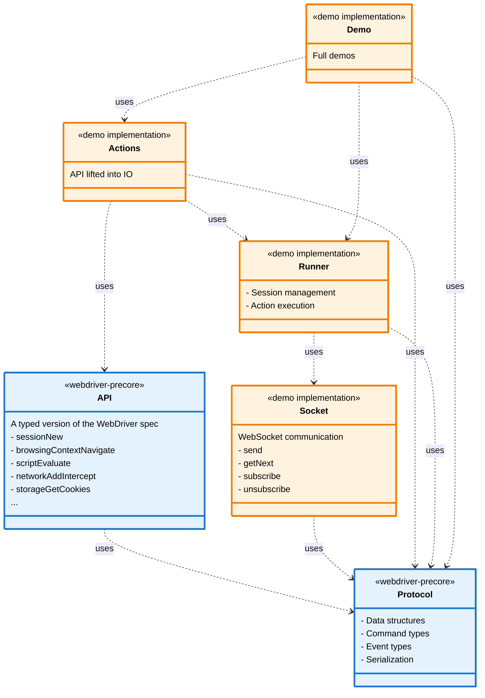

# webdriver-tests

## About This Test Suite

Although `webdriver-precore` only provides types, and does not provide any runner for WebDriver interaction, it is necessary to implement such a runner so the types generated by this library can be verified. This being the case, this test suite serves two purposes:

1. provides a demo client implementation for both Http and BiDi protocols
2. the demos are used as test the types exported by `WebDriverPreCore.HTTP.API` and `WebDriverPreCore.BiDi.API` by running the demo client implementation against a real driver

These examples demonstrate a minimal wrapper implementation around the [`webdriver-precore`](https://hackage.haskell.org/package/webdriver-precore) library for basic browser automation using.

Key simplifications compared to a production-ready framework:
- No utility functions or automated browser/session management
- Minimal robustness features (no advanced waits or retry mechanisms)

The demos cover all W3C WebDriver endpoints for [HTTP](https://www.w3.org/TR/webdriver2/#endpoints) protocol and [BiDi](https://www.w3.org/TR/webdriver-bidi/) commands and events.

## Core Modules


*For BiDi the modules the module structure looks like this*



### HttpRunner

[HttpRunner](./driver-demo-e2e/Http/HttpRunner.hs) exports a single `run` function that accepts a [webdriver-precore HttpSpec](https://hackage-content.haskell.org/package/webdriver-precore-0.0.0.1/package/docs/WebDriverPreCore.html#g:14) and performs HTTP requests to an active WebDriver instance.

### HttpAPI

[HttpAPI](./driver-demo-e2e/Http/HttpAPI.hs) is [W3C WebDriver](https://www.w3.org/TR/webdriver2) client implemented by applying `run` to every endpoint exported by [webdriver-precore](https://hackage-content.haskell.org/package/webdriver-precore).

### HttpE2EDemoTest

[HttpE2EDemoTest](./driver-demo-e2e/Http/HttpE2EDemoTest.hs) is \"unit test" module where the unit tests are actually example stubs that demonstrate driving a browser via the [HttpAPI](./driver-demo-e2e/Http/HttpE2EDemoTest.hs).

## Running Examples (VSCode Dev-Container)

 *The following assumes the pre-requisites for [dev-containers](https://code.visualstudio.com/docs/devcontainers/containers#_getting-started) are installed* 
 
 *See [Running Examples (Manual Configuration)](#running-examples-manual-configuration) if you are not dev-container user.*

The dev-container provided includes all the Haskell tools required, pre-compiled dependencies and Firefox and geckodriver. The examples will be compiled and geckodriver started when the container starts.
 
From VSCode invoke: <BR/> 
&nbsp;&nbsp; \>> `Show All Commands` <BR/> 
&nbsp;&nbsp; \>> `Dev Containers: Clone Repository in Dev Container Volume...`<BR/>
&nbsp;&nbsp; \>> `Clone a repository from Github in a Container Volume`<BR/>
&nbsp;&nbsp; \>> search and select `pyrethrum/webdriver`<BR/>
&nbsp;&nbsp; \>> `main` branch

Once the container downloads starts, you should be ready to run the examples (see [Executing the Examples](#executing-the-examples) below).

## Running Examples (Manual Configuration)

### Prerequisites
*Assuming Haskell and the related tooling is installed.*

#### 1. Web Driver Installed

A browser and corresponding vendor provided WebDriver is required. These stubs have been run with Firefox and Chrome, drivers although other drivers are available, and should work.

Drivers can be downloaded from the vendors' web sites e.g.:
  1. [Firefox](https://github.com/mozilla/geckodriver/releases)
  2. [Chrome](https://googlechromelabs.github.io/chrome-for-testing/)

*Follow the vendor / community provided documentation for installation instructions*

**Note:** Linux users of `geckodriver` (the Firefox driver), may, under some circumstances, encounter **profile related errors when initialising WebDriver** sessions. A solution can be found [at the end of this document](#fixing-geckodriver-firefox-profile-issues)

#### 2. The Project Builds

In the the integrated terminal in your IDE run:

1. ensure you are in the project directory
2. `cabal update`
3. `cabal build all --enable-tests `

On linux  this would look something like

```bash
~/repos/webdriver$ cabal update

Configuration is affected by the following files:
- cabal.project
Downloading the latest package list from hackage.haskell.org
Package list of hackage.haskell.org has been updated.
The index-state is set to 2025-06-22T01:41:09Z.
To revert to previous state run:
    cabal v2-update 'hackage.haskell.org,2025-06-22T00:48:21Z'

~/repos/webdriver$ cabal build all --enable-tests 

Configuration is affected by the following files:
... many build log entries
```

*You may need to restart your IDE or envoke `Haskell: Restart Haskell LSP server` after your first rebuild.*
#### 3. Web Driver Running

Before running any of the examples you need to invoke the WebDriver from the terminal. On Linux this can be done with one of the following bash commands:

**Firefox (Geckodriver)**

*`--log trace` is optional*

```
>  pkill -f geckodriver || true  && geckodriver --log trace
```

*expect output like*

```
1744430539316   geckodriver     INFO    Listening on 127.0.0.1:4444
1744430539316   webdriver::server       TRACE   Build standard route for /status
.... and many other trace statements if running with --log trace
```

**Chrome (Chromedriver)**

*`--log-level=ALL` is optional*

*The port is set to 4444 to match the port hard coded in our test suite*

```
> pkill -f chromedriver || true && chromedriver --log-level=ALL --port=4444
```

*expect output like*

```
Starting ChromeDriver 135.0.7049.52 (9ba7e609d28c509a8ce9265c2247065d8d251173-refs/branch-heads/7049_41@{#4}) on port 4444
Only local connections are allowed.
Please see https://chromedriver.chromium.org/security-considerations for suggestions on keeping ChromeDriver safe.
ChromeDriver was started successfully on port 4444.
```

#### 4. Configuration Set

The first time you attempt to run a test a default config file will be generate at: </br>
&nbsp;&nbsp; `webdriver-examples\driver-demo-e2e\.config\config.dhall`. 

You will will probably need to make adjustments to this file to get these tests to run successfully.
</br>See [Executing the Examples](#executing-the-examples) (below) for details.


## Executing Demos from the Test Suite

Once the [driver is running](#3-web-driver-running), the recommended way to experiment in these examples is to use the `Evaluate...` lens provided by Haskell Language Server in VSCode.

### Evaluate...

1. From VSCode `Ctrl+P` \>> search `demo`
2. Open `HttpE2EDemoTest`
3. Wait for HLS to process the file, at which point the `Evaluate...` lens will be visible


Clicking `Evaluate...` will execute the test.
* any exceptions will be inserted in the source file under the evaluation
* any console logs generated form the test will be piped to the `OUTPUT` window for `Haskell (webdriver)` 
* when the first test is run it will probably fail due to configuration issues (see [Updating Test Configuration](#updating-test-configuration))
### cabal repl
*Alternatively tests can be run in `cabal repl --enable-tests` from the `webdriver-examples` directory:*

```
~/webdriver/webdriver-examples$ cabal repl --enable-tests
ghci> HttpE2EDemoTest.unit_demoSendKeysClear
fill in user name
clear user name
```

### cabal test

*Or run all tests by running `cabal test` from the `webdriver-examples` directory:*

```
~/webdriver/webdriver-examples$ cabal test
.. all test logs 
```

## Updating Test Configuration

As mentioned above, the first time you attempt to run one of these tests it may well fail due to configuration issues.

The first time a test is run a [config.dhall](./driver-demo-e2e/.config/config.dhall) file will be created. 

Edit the value as per your requirements (eg. using Chrome instead of Firefox)

```haskell

...
-- Config value
let browser : Browser = 
      Browser.Chrome

let config : Config = 
      { browser = browser
      , wantConsoleLogging = False
      }

in config

```

Or setting the Firefox profile path (see below)

## Fixing Geckodriver Firefox Profile Issues on Linux

There is a [known issue](https://github.com/mozilla/geckodriver/releases/tag/v0.36.0) with geckodriver on linux machines when Firefox has been installed inside a container such as when installed with `snap` or `flatpak` and also the `default Firefox installation` for Ubuntu.

When `Firefox` is installed in this way, `geckodriver` does not have the required permissions to access the Firefox profile directory causing an exception to be thrown on session creation:


One solution is to create a profile in a directory somewhere accessible to geckodriver on the file system:

1. Create a new folder called `test-firefox-profile` in an accessible place such as your linux `Home` directory
2. In Firefox type the following into the search bar: `about:profiles` to be take to `About Profiles`
3. Note your current `Default Profile`
4. `Create New Profile` 
5. `Next`
6. `Profile Name:` **WebDriver**
7.  `Choose Folder...` >> browse to `test-firefox-profile` >> `Select`
8. `Finish`
9. This new profile will automatically be set to the default profile. Set the `Default Profile` back to your initial profile or you will not be able to see the usual shortcuts and other settings when you restart Firefox
10. Copy the `Root Directory` path for the **WebDriver** profile to the clipboard
11. The first time a test was run, a [config.dhall](./driver-demo-e2e/.config/config.dhall) file which was created. Update `profilePath` in this config to point to the WebDriver profile directory:

```haskell
...
-- Config value
let browser : Browser = 
      Browser.Firefox 
        { headless = False
        , profilePath = Some "YOUR/PARENT/DIRECTORY/test-firefox-profile"
        }

let config : Config = 
      { browser = browser
      , wantConsoleLogging = False
      }

in config
```

Tests should now be able to create sessions successfully.


----
legacy

# Minimal Example

*TLDR ~ bring your own HTTP client and use it to implement the endpoints as defined in this library.*

Driving a browser using this library requires the following:
1. Implement a `runner` that takes a [HttpSpec](#HttpSpec) and makes HTTP calls an active WebDriver instance
2. Create an IO API by applying the `runner` to each of the endpoint functions in this library
3. Install the desired browser and browser driver
4. Run the driver
5. Drive the browser via the IO API

The full source can be found in the [example project repo](https://github.com/pyrethrum/webdriver/blob/main/webdriver-examples/README.md).


## 1. Implementing a runner

The first step in writing a WebDriver implementation is to choose an HTTP library. In this example, the chosen library is [req](https://hackage.haskell.org/package/req).

Then to implement a run function requires the following:

1. Transform a [HttpSpec](#HttpSpec) to RequestParams compatible with the chosen HTTP library.
2. Make an HTTP call to WebDriver as per the RequestParams and return a simplified [HttpResponse](#httpresponse).
3. Use the parser provided by the [HttpSpec](#HttpSpec) to parse the [HttpResponse](#httpresponse) and handle any errors.

#### Main Types (Used in the Runner)

The two most important types in this library are:

##### HttpSpec

The `HttpSpec` returned by each of this library's endpoint functions. This type represents a driver endpoint.

```haskell
data HttpSpec a
  = Get
      { description :: Text,
        path :: UrlPath,
        parser :: HttpResponse -> Result a
      }
  | Post
      { description :: Text,
        path :: UrlPath,
        body :: Value,
        parser :: HttpResponse -> Result a
      }
  | PostEmpty
      { description :: Text,
        path :: UrlPath,
        parser :: HttpResponse -> Result a
      }
  | Delete
      { description :: Text,
        path :: UrlPath,
        parser :: HttpResponse -> Result a
      }
```

##### HttpResponse

`HttpResponse` is consumed by the `parser` provided by this library and needs to be constructed by the `runner`

```haskell
data HttpResponse = MkHttpResponse
  { -- | HTTP status code.
    statusCode :: Int,
    -- | HTTP status message.
    statusMessage :: Text,
    -- | Response body in JSON format.
    body :: Value
  }
```

#### The Runner

[source](https://github.com/pyrethrum/webdriver/blob/main/webdriver-examples/driver-demo-e2e/HttpRunner.hs)


```haskell
run :: HttpSpec a -> IO a
run spec = do
  -- 1. Convert HttpSpec to params for req
  let request = mkRequest spec
  -- 2. Call WebDriver server (via req) and return a simplified HttpResponse 
  response <- callReq request
  -- 3. Apply the HttpSpec parser to the HttpResponse get result type and handle errors  
  parseResponse spec response  
```

### 1.1 Convert HttpSpec to params for req

*HttpSpec -> ReqRequestParams*

```haskell
-- A custom data type specific to req
data ReqRequestParams where
  MkRequestParams ::
    (HttpBodyAllowed (AllowsBody method) (ProvidesBody body), HttpMethod method, HttpBody body) =>
    { url :: Url 'Http,
      method :: method,
      body :: body,
      port :: Int
    } ->
    ReqRequestParams

-- HttpSpec -> ReqRequestParams
-- the url and port would not normally be hard coded
mkRequest :: forall a. HttpSpec a -> ReqRequestParams
mkRequest spec = case spec of
  Get {} -> MkRequestParams url GET NoReqBody 4444 
  Post {body} -> MkRequestParams url POST (ReqBodyJson body) 4444
  PostEmpty {} -> MkRequestParams url POST (ReqBodyJson $ object []) 4444
  Delete {} -> MkRequestParams url DELETE NoReqBody 4444
  where
    url =  foldl' (/:) (http "127.0.0.1") spec.path.segments
```

### 1.2 Call the WebDriver

*ReqRequestParams -> HttpResponse*

```haskell
callReq :: ReqRequestParams -> IO HttpResponse
callReq MkRequestParams {url, method, body, port = prt} =
  runReq defaultHttpConfig {httpConfigCheckResponse = \_ _ _ -> Nothing} $ do
    r <- req method url body jsonResponse $ port prt
    pure $
      MkHttpResponse
        { statusCode = responseStatusCode r,
          statusMessage = responseStatusText r,
          body = responseBody r :: Value
        }
  where
    responseStatusText = decodeUtf8Lenient . responseStatusMessage
```

### 1.3 Parse HttpResponse Using the Parser Provided in the [HttpSpec](#HttpSpec)

*HttpResponse -> Return Type*

```haskell
-- in this implementation we are just throwing exceptions on failure
parseResponse :: HttpSpec a -> HttpResponse -> IO a
parseResponse spec r =
  spec.parser r
    & \case
      Error msg -> fail $ parseWebDriverError r & \case
          e@NotAnError {} -> unpack spec.description <> "\n" <> 
                            "Failed to parse response:\n " <> msg <> "\nin response:" <> show e
          e@UnrecognisedError {} -> "UnrecognisedError:\n " <> "\nin response:" <> show e
          e@WebDriverError {} -> "WebDriver error thrown:\n " <> show e
      Success a -> pure a
```

### 2. Applying the Runner to the HttpSpec Functions

*Create an IO API by applying run to each endpoint definition exposed by this library*

The full source for can be found in the [example project repo](https://github.com/pyrethrum/webdriver/blob/main/webdriver-examples/driver-demo-e2e/IOAPI.hs).
```haskell
module IOAPI where 

import Data.Aeson (Value)
import Data.Text  as T (Text)
import WebDriverPreCore.Http (DriverStatus, ElementId, Selector, Session)
import WebDriverPreCore.Http qualified as W
import Prelude hiding (log)
import IOUtils (sleepMs, encodeFileToBase64)
import HttpRunner (run)

status :: IO DriverStatus
status = run W.status

newSession :: W.FullCapabilities -> IO Session
newSession = run . W.newSession

getTimeouts :: Session -> IO W.Timeouts
getTimeouts = run . W.getTimeouts

setTimeouts :: Session -> W.Timeouts -> IO ()
setTimeouts s = run . W.setTimeouts s

getCurrentUrl :: Session -> IO Text
getCurrentUrl = run . W.getCurrentUrl

getTitle :: Session -> IO Text
getTitle = run . W.getTitle

maximizeWindow :: Session -> IO W.WindowRect
maximizeWindow = run . W.maximizeWindow

-- ... and 50+ more API functions
```

### 3. Install a Vendor Provided WebDriver

*Once all the required endpoints are implemented you will be able to interact with browsers via WebDriver*

Examples:
  1. [Firefox](https://github.com/mozilla/geckodriver/releases)
  2. [Chrome](https://googlechromelabs.github.io/chrome-for-testing/)
  3. [Edge](https://developer.microsoft.com/en-us/microsoft-edge/tools/webdriver?form=MA13LH)
  4. [Opera](https://github.com/operasoftware/operachromiumdriver?tab=readme-ov-file)
  5. [Safari](https://developer.apple.com/documentation/webkit/testing-with-webdriver-in-safari)

*Ensure the corresponding browser is installed on your system*

### 4. Launch WebDriver From the Terminal

e.g. For Firefox and geckodriver on Linux or WSL you could start geckodriver from the terminal as follows: 

*Note: we are setting the port to 4444, which is the hard coded port in our example.*

```bash
> pkill -f geckodriver || true  && geckodriver --port=4444 &
```
or with logging:

```bash
> pkill -f geckodriver || true  && geckodriver --log trace --port=4444 &
```

or similarly for Chrome and chromedriver:

```bash
> pkill -f chromedriver || true && chromedriver --port=4444 &
```

or with logging:

```bash
> pkill -f chromedriver || true && chromedriver --log-level=ALL --port=4444 &
```

### 5. Drive the Browser Via the IO API

*With the driver running you can now run code that interacts with the browser:*

Full source file can be found in the [example project repo](https://github.com/pyrethrum/webdriver/blob/main/webdriver-examples/driver-demo-e2e/HttpE2EDemoTest.hs).

```haskell
demoForwardBackRefresh :: IO ()
demoForwardBackRefresh = do
  ses <- newSession $ minFullCapabilities Firefox
  navigateTo ses "https://the-internet.herokuapp.com/"
  link findElement ses $ CSS "#content ul:nth-child(4) > li:nth-child(6) > a:nth-child(1)"
  elementClick ses link
  back ses
  forward ses
  refresh ses
  deleteSession ses
```

*This is a minimal API. There is plenty of scope to build on this to provide more constrained types, user-friendly functions and capabilities such as retries, and session and driver management.*