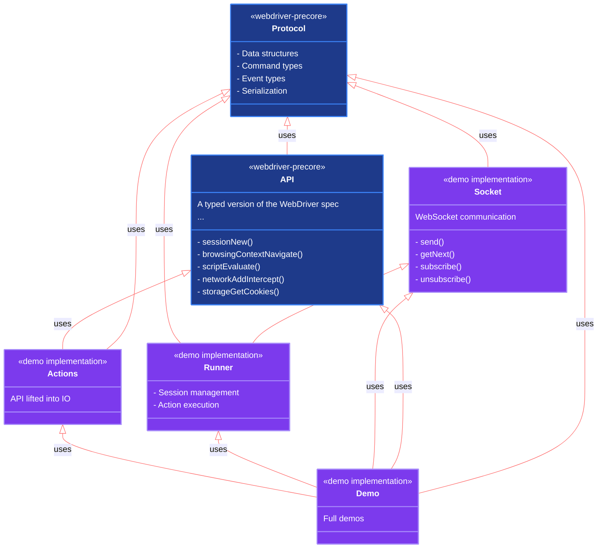

<!-- used deepseek to render this and update colours for dark and light background, other tools like mermaid live were truncating the text -->

```mermaid
%%{init: {'themeVariables': { 
  'lineColor': '#ff6b6b',
  'arrowheadColor': '#ff6b6b'
}}}%%

classDiagram
    direction TB
    
    class Demo {
        <<demo implementation>>
        Full demos
    }
    
    class Actions {
        <<demo implementation>>
        API lifted into IO
    }
    
    class Runner {
        <<demo implementation>>
        - Session management
        - Action execution
    }
    
    class Socket {
        <<demo implementation>>
        WebSocket communication
        - send()
        - getNext()
        - subscribe()
        - unsubscribe()
    }
    
    class API {
        <<webdriver-precore>>
        A typed version of the WebDriver spec
        - sessionNew()
        - browsingContextNavigate()
        - scriptEvaluate()
        - networkAddIntercept()
        - storageGetCookies()
        ...
    }
    
    class Protocol {
        <<webdriver-precore>>
        - Data structures
        - Command types
        - Event types
        - Serialization
    }
    
    %% Relationships - Demo uses everything below it
    Actions <|-- Demo : uses
    Runner <|-- Demo : uses
    Socket <|-- Demo : uses
    API <|-- Demo : uses
    Protocol <|-- Demo : uses
    
    %% Actions uses API and Protocol
    API <|-- Actions : uses
    Protocol <|-- Actions : uses
    
    %% Runner uses Protocol and Socket
    Protocol <|-- Runner : uses
    Socket <|-- Runner : uses
    
    %% Socket uses Protocol
    Protocol <|-- Socket : uses
    
    %% API uses Protocol
    Protocol <|-- API : uses
    
    %% Styling - Top layer (Demo classes)
    style Demo fill:#7c3aed,stroke:#a78bfa,stroke-width:2px,color:#ffffff,rx:10
    style Actions fill:#7c3aed,stroke:#a78bfa,stroke-width:2px,color:#ffffff,rx:10
    style Runner fill:#7c3aed,stroke:#a78bfa,stroke-width:2px,color:#ffffff,rx:10
    style Socket fill:#7c3aed,stroke:#a78bfa,stroke-width:2px,color:#ffffff,rx:10
    
    %% Styling - Bottom layer (Core classes)
    style API fill:#1e3a8a,stroke:#3b82f6,stroke-width:2px,color:#ffffff,rx:10
    style Protocol fill:#1e3a8a,stroke:#3b82f6,stroke-width:2px,color:#ffffff,rx:10
```

